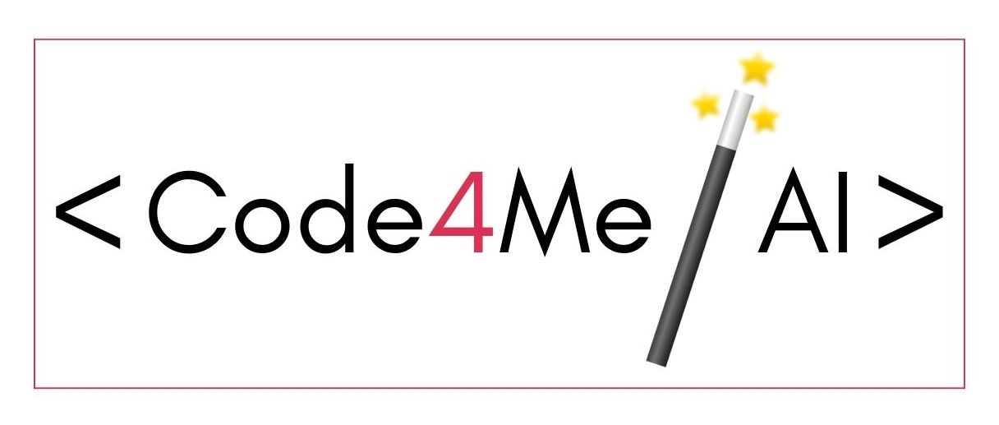
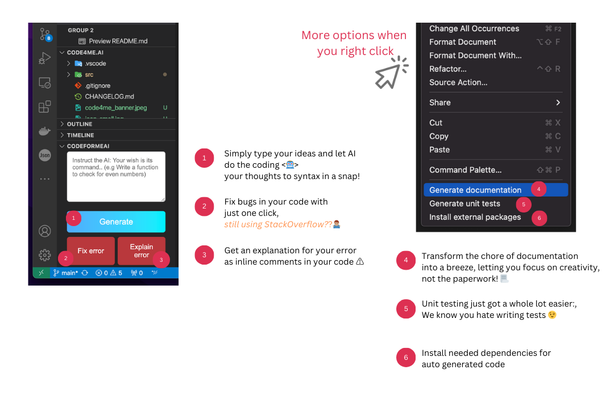
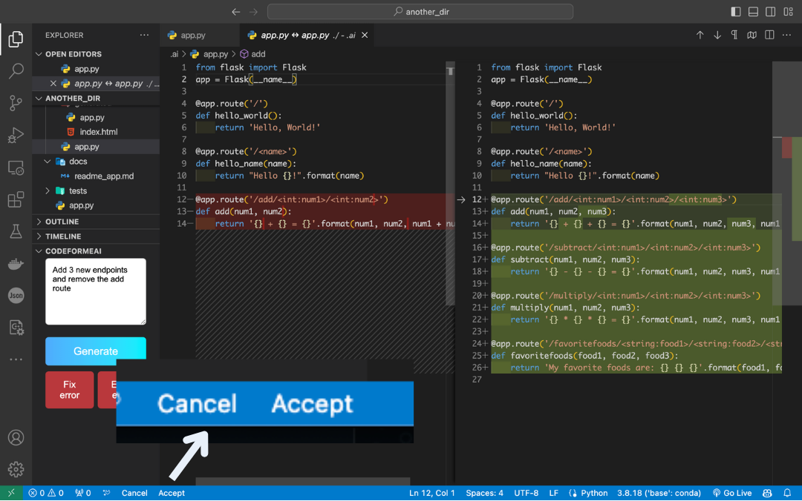
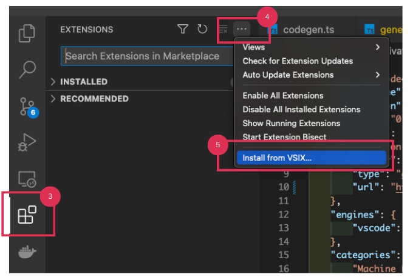
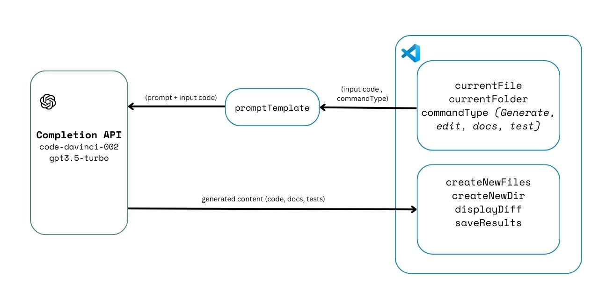

## Code4Me.AI
Imagine an AI-powered tool just within your IDE that turns your ideas into code through natural language—our VS Code extension does precisely that. The Code4Me.ai extension not only aids in code generation and auto-debugging but also excels in generating unit tests and crafting quality documentation, boosting productivity and development speed by 10x for both novices and expert developers alike. 

## Feature Summary

  

### You're still in control!

Stay in control and in the loop: Code4Me.ai not only generates code but also presents it just like a Git diff. This way, you can review, tweak, or directly accept the AI-crafted code, ensuring it perfectly aligns with what you want.

  

## How to install

Installation guide

## 1. Download the .vsix File
- The `.vsix` file for `Code4Me.ai` is available in this GitHub repository.
- You can either clone the repository or download it as a ZIP file.
    - To clone, use: `git clone [Repository URL]`
    - Or download the ZIP file
## 2. Open Visual Studio Code
- Launch Visual Studio Code on your computer.

## 3. Access the Extensions View
- Click on the Extensions icon in the Activity Bar on the side of the window.
- In the Extensions view, click on the `...` (More Actions) button at the top right.
- Select `Install from VSIX...` from the dropdown menu.

    

    

    

## 4. Locate and Select the .vsix File
- Navigate to where you cloned/downloaded the repo in the file dialog.
- Select the `.vsix` file and click `Open`.
- VS Code will now install the extension.

## 5. Reload/Restart VS Code
- You may need to reload VS Code to activate the extension.
- Click the `Reload` button if prompted, or restart VS Code.

## 8. Verify Installation
- Check the Extensions view to ensure the extension is listed as installed.

## 9. OpenAI Key
- On the first use you'll be prompted to add your openai api key.

## How it works 🛠️⚙️

  

1. **Grab the Current Code:**

    First, our tool looks at what you're working on. It takes the code from the open file in your editor. If the file is new and empty, that's okay too—our AI can handle that.

2. **Your Instructions**

    Next, you tell the tool what you need. You can type this in a box at the bottom left of the AI Coding panel. We've also got some common tasks ready to go, like adding packages or making tests.

3. **AI Does Its Thing (OpenAI Completions API)**

    Then, we send your instructions and the code to the AI. It starts working and keeps going until it's done writing the code you need.

4. **You Check the Code**

    Finally, you get to see the new code next to your old one, just like when you look at changes in Git. If you like what you see, hit accept, and the new code gets added to your file. Simple as that!